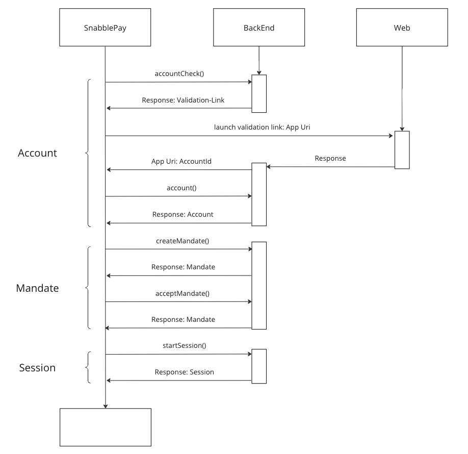

# Snabble Pay SDK for iOS

<p align="center">
    <a href="https://github.com/snabble/snabble-pay-ios-sdk/releases">
        
    </a>
    <a href="https://swiftpackageindex.com/snabble/snabble-pay-ios-sdkS">
        
    </a>
    <a href="https://swiftpackageindex.com/snabble/snabble-pay-ios-sdk">
        
    </a>
    <br/>
    <a href="https://docs.snabble.io/snabble-pay-ios-sdk/documentation/snabblepay/">
        
    </a>
    <a href="https://docs.snabble.io/payment-service/">
        
    </a>
</p>

## Getting Started

### Initialize Snabble Pay

SnabblePay needs to be initialized with an `ApiKey` associated with your project. Optional variables are the `Credential` and an `URLSession`. The `Credential` are reported by the `SnabblePayDelegate` after the first payment method is added. You are responsible for storing the information securely. These credentials need to be provided for existing users. Don't forget to set the `delegate` to store the `Credential` instance and `environment` variable for testing.

```swift
var credentials: Credentials?
if let encodedCredentials = UserDefaults.credentials {
    credentials = try? JSONDecoder().decode(Credentials.self, from: encodedCredentials)
}

let snabblePay: SnabblePay = .init(
    apiKey: "IO2wX69CsqZUQ3HshOnRkO4y5Gy/kRar6Fnvkp94piA2ivUun7TC7MjukrgUKlu7g8W8/enVsPDT7Kvq28ycw==", // this is a test API-KEY
    credentials: credentials
)
snabblePay.environment = .development // .staging, .production
snabblePay.delegate = snabblePay
```


```swift
extension SnabblePay: SnabblePayDelegate {
    public func snabblePay(_ snabblePay: SnabblePay, didUpdateCredentials credentials: Credentials?) {
        if let encoded = try? JSONEncoder().encode(credentials) {
            UserDefaults.credentials = encoded
       } else {
            UserDefaults.credentials = nil
        }
    }
}
```

### Example Flow for a new account, new mandate and a session start
The following sequence displays the basic flow (happy path) from creating a new account up to starting a new session.



Use `accountCheck` to receive an `AccountCheck` holding the validation link.

```swift
snabblePay.accountCheck(
    withAppUri: "snabble-pay://account/check", // Callback URLScheme to inform the app that the process is completed
    city: "Bonn", // The city of residence
    countryCode: "DE" // The countryCode [PayOne - ISO 3166](https://docs.payone.com/pages/releaseview.action?pageId=1213959) of residence
)
```

Open the `validationURL` to start the payment method verification. After a succeeded validation the user will be redirected to the application over the given appUri, which contains an `accountId` as query parameter. 

The account should then be fetched with the given `accountId`.

```swift
snabblePay.account(withId: accountId)
```

If the mandate for the account is missing, a new one needs to be created with the `accountId`.

```swift
snabblePay.createMandate(forAccountId: accountId)
```

Accept the mandate to continue with further interaction. To accept a mandate, the application must specify the `accountId` for the mandate and the `mandateId` that the mandate received in the previous call.

```swift
snabblePay.acceptMandate(withId: mandateId, forAccountId: accountId)
```

After the mandate has been accepted successfully, a `Session` can be started to generate a QRCode. The application needs to provide an `accountId`, which should be used for the payment.

```swift
snabblePay.startSession(withAccountId: accountId)
```

The `Session` has a variable `Token`. Please use the `value` variable of the `Token` to display a QR-Code.